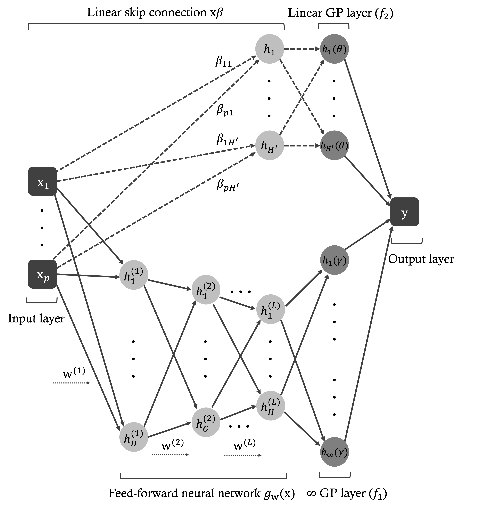

# DKLasso: Advanced Deep Kernel Learning for Robust Predictions with Confidence Intervals and Feature Selection

`DKLasso` and `DKLasso+` integrate the feature sparsity of L1 regularization into the probabilistic framework of 
Deep Kernel Learning (DKL), enabling simultaneous feature selection and reliable predictions. This approach offers a 
spectrum of solutions with varying levels of feature sparsity, allowing the detection of complex patterns while 
preserving the interpretability of input features. Moreover, by leveraging the probabilistic strengths of Gaussian 
processes, `DKLasso` and `DKLasso+` deliver robust predictions with confidence intervals.

Experimental results show that these methods consistently outperform state-of-the-art models in both feature selection 
and uncertainty quantification, making them highly valuable for risk-sensitive applications.

## Learn more

For more information, you can view my recent talk at the Banff International Research Station for Mathematical Innovation and Discovery (BIRS).

[BIRS](https://www.birs.ca/events/2024/5-day-workshops/24w5292/videos/watch/202407260933-Zeng.html)

## References

- [LassoNet: A Neural Network with Feature Sparsity.](https://jmlr.org/papers/volume22/20-848/20-848.pdf)

- [Deep Kernel Learning](http://proceedings.mlr.press/v51/wilson16.pdf)

- [The Promises and Pitfalls of Deep Kernel Learning](https://proceedings.mlr.press/v161/ober21a/ober21a.pdf)
